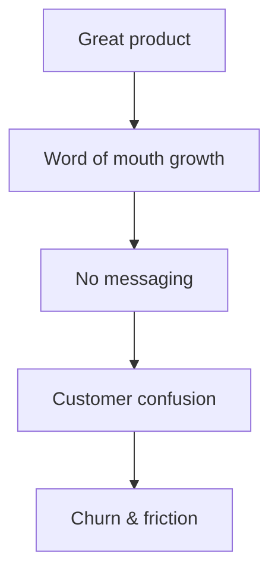

# Building Fieldd's Marketing From Scratch

<Field icon="seedling" />

Before I joined, Fieldd had no marketing team — just a powerful platform, a loyal customer base, and a product that sold itself (barely). My job was to take what was working behind the scenes and turn it into a story people understood.

---

## 🚧 The Starting Point

<warn>
  Fieldd had zero brand voice, no campaigns, and no consistent way to explain what it did. Marketing was a blank slate.
</warn>

## Identifying the issue

<CardGroup cols={3}>
  <Card title="Clarify the Message" icon="message" href="#positioning">
    Create repeatable, clear language around core features
  </Card>
  <Card title="Launch Campaigns" icon="megaphone" href="#campaigns">
    Design and ship Fieldd’s first real marketing efforts
  </Card>
  <Card title="Design Visuals" icon="palette" href="#assets">
    Support all copy with visuals, animations, and brand polish
  </Card>
</CardGroup>