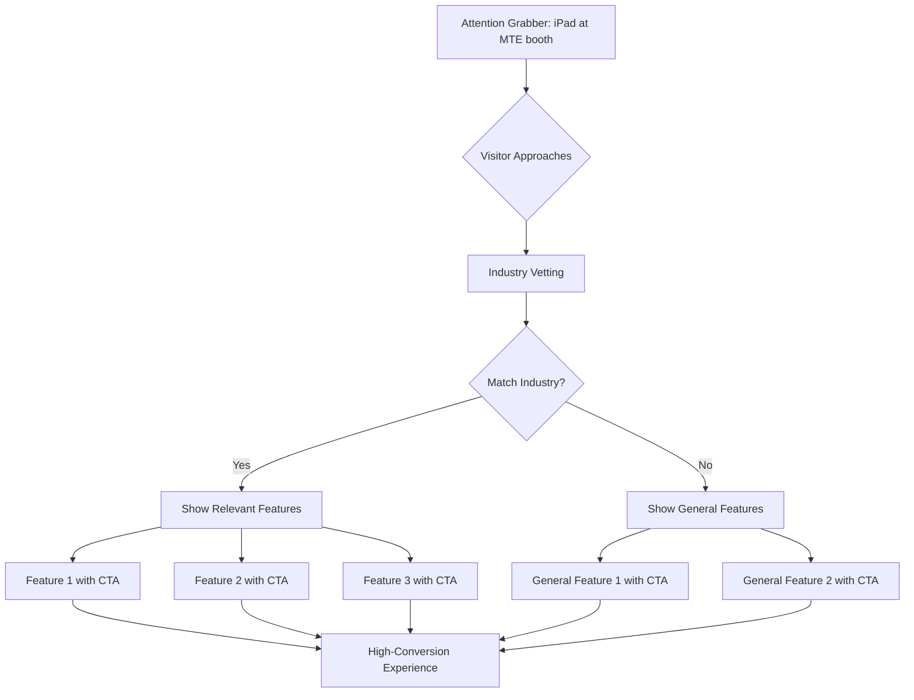

# What is the MTE?

The MTE is a trade show designed to educate and elevate the mobile detailing industry...**our target demographic.**

I had the opportunity of attending the MTE 1 month into my employment at fieldd, and like most trade shows, most people would walk right past.

## Rethinking the entire playbook

1 year later and we were preparing for the MTE once again. I couldn't shake how distracted the event is, so I wanted to craft an experience unique to MTE attendees that would allow them to educate themselves without the need of a salesman. Here's the flow:

## The final product

An interactive experience that brings the modern experience of fieldd to the users hands immediately. 

<iframe style="border: 1px solid rgba(0, 0, 0, 0.1);" width="800" height="450" src="https://embed.figma.com/proto/Dcd3AvUT6EjH13mg6zLraX/MTE-Presentation-Prototypes?page-id=0%3A1&node-id=61-74&p=f&viewport=280%2C346%2C0.06&scaling=scale-down&content-scaling=fixed&starting-point-node-id=61%3A74&embed-host=share" allowfullscreen />